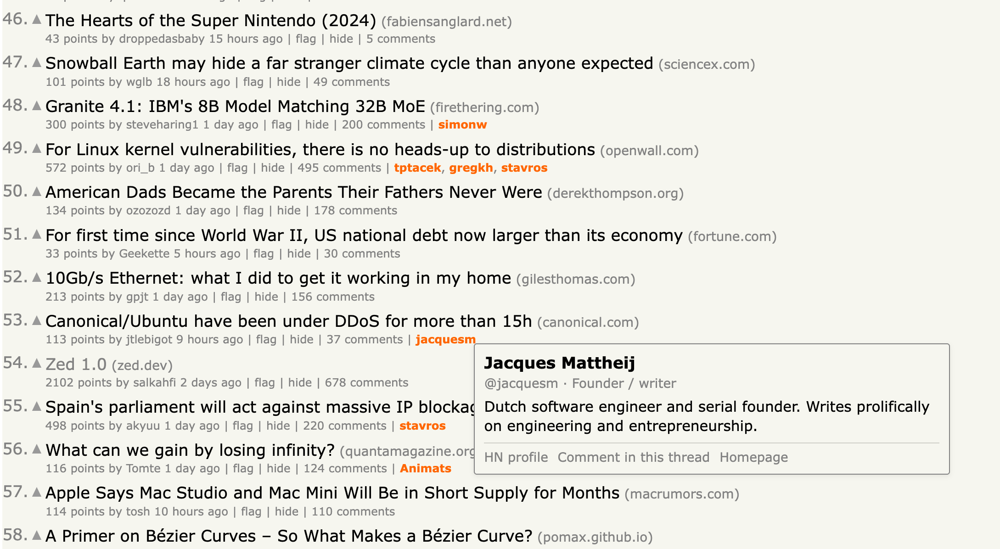

# Orange Names

Browser extension that paints notable Hacker News users orange. Click a highlighted name to see who they are.

## Install

### Firefox

1. Open `about:debugging#/runtime/this-firefox`
2. Click "Load Temporary Add-on"
3. Select `firefox/manifest.json`

### Chrome

1. Open `chrome://extensions`
2. Enable "Developer mode"
3. Click "Load unpacked" and select the `chrome/` folder

## Updating the notables list

Edit `firefox/notables.js`. Each entry maps an HN username to name, role, bio, and links. Then run `npm run sync` to copy the shared files into `chrome/` (CI fails if they drift).
